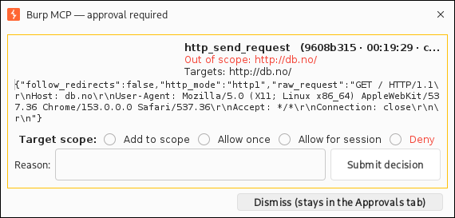
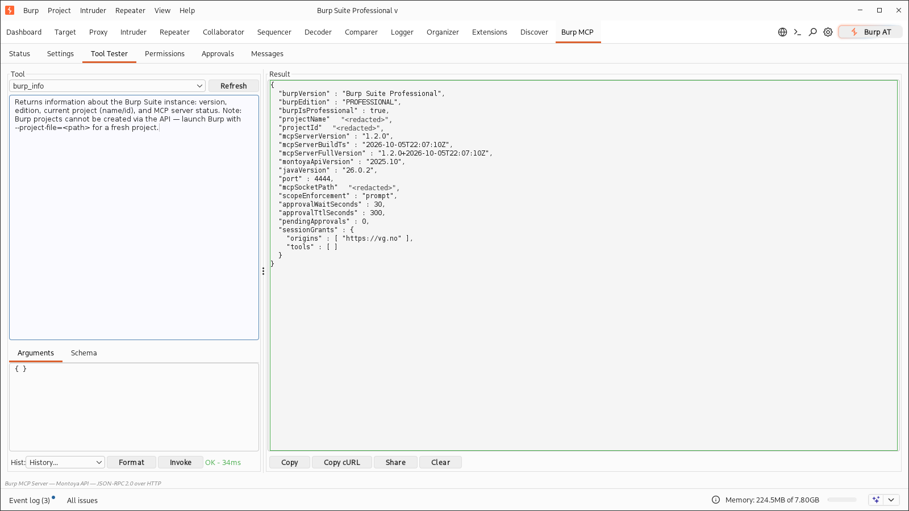
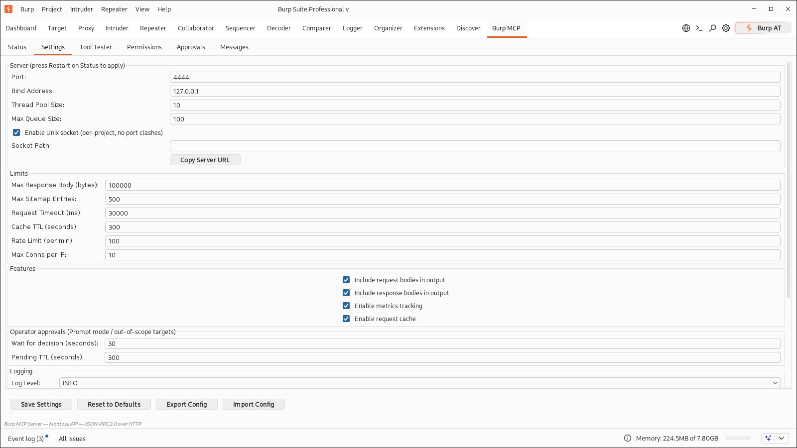
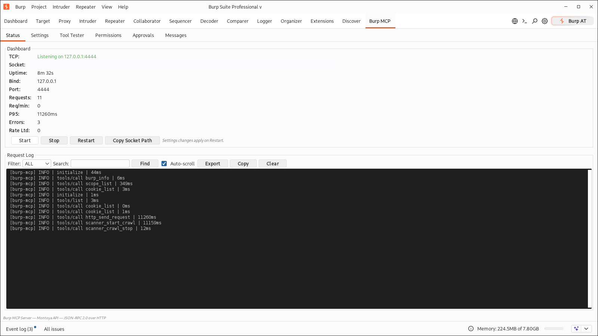

# Burp MCP Server

A Burp Suite extension that exposes your running Burp as MCP tools. An AI
agent can send HTTP requests, read proxy history and the site map, drive the
scanner, and hand requests to Repeater, Intruder, Comparer, or Organizer.

It runs in Burp's JVM and speaks JSON-RPC 2.0 over HTTP, on TCP or a
per-project Unix socket.

| Component | Value |
|-----------|-------|
| Host | Burp Suite Community or Professional |
| Tools | 53 across HTTP, proxy, sitemap, scope, scanner, Collaborator, Organizer, config |
| Transports | TCP on `127.0.0.1:4444`, plus a Unix socket per project |
| Professional-only | Scanner, crawler, and Collaborator tools |
| Clients | Any MCP client that can POST JSON-RPC to an HTTP URL |

## Getting the extension

Download `burp-mcp-server.jar` from the
[latest release](https://github.com/N0K0/burp-mcp/releases), or build current
`main`:

```bash
git clone https://github.com/N0K0/burp-mcp.git
cd burp-mcp
mvn clean package -DskipTests
```

JDK 17 or newer and Maven 3.9 or newer are required. The build writes
`target/burp-mcp-server.jar`.

Load it under Extensions -> Installed -> Add -> Java. Burp does not reload
Java extensions, so remove and re-add the entry after a rebuild. On WSL with
`/mnt/c` present, the build also copies the jar to
`C:\Users\nikolas\Downloads\`.

## Checking it works

```bash
# list the tools
curl -s -X POST -H "Content-Type: application/json" \
  -d '{"jsonrpc":"2.0","method":"tools/list","id":"1"}' \
  http://127.0.0.1:4444/

# ask Burp about itself
curl -s -X POST -H "Content-Type: application/json" \
  -d '{"jsonrpc":"2.0","method":"tools/call","params":{"name":"burp_info","arguments":{}},"id":"2"}' \
  http://127.0.0.1:4444/

# health check
curl -s http://127.0.0.1:4444/health
```

The same calls work over the Unix socket. Get the path from `burp_info` ->
`mcpSocketPath`, or from the Status tab:

```bash
SOCK=$(curl -s -X POST -H "Content-Type: application/json" \
  -d '{"jsonrpc":"2.0","method":"tools/call","params":{"name":"burp_info","arguments":{}},"id":"1"}' \
  http://127.0.0.1:4444/ \
  | python3 -c "import json,sys; print(json.loads(json.load(sys.stdin)['result']['content'][0]['text'])['mcpSocketPath'])")

curl -s --unix-socket "$SOCK" http://localhost/health
```

## How it fits together

The extension runs inside Burp's JVM on the Montoya API, so an agent works on
the project you have open: the same proxy history, site map, scope, cookies,
and Professional license.

It adds a "Burp MCP" tab with six screens: Status (Start/Stop/Restart,
metrics, request log), Settings, Tool Tester, Permissions, Approvals, and
Messages.

## Screenshots

A gated call waits for an operator decision in the popup — Allow once, Allow
for session, or Deny with a reason that is returned to the agent. Dismissing it
leaves the request in the Approvals tab, which badges while anything is
pending:



`burp_info` reports the live gate state — scope enforcement mode, approval
wait/TTL, pending count, and session grants — so agents can see why a call was
blocked:



Approval timing lives in Settings with the other server limits:



The Status tab shows the listeners, metrics, and request log:



## Compared with PortSwigger's MCP server

PortSwigger ships an [official MCP server](https://github.com/PortSwigger/mcp-server)
(Kotlin, GPL-3.0). Both let MCP clients drive Burp; they make different
tradeoffs. Official details below are from its repository as of October 2026.

| Aspect | PortSwigger official | This extension |
|---|---|---|
| Transport | MCP over SSE on `127.0.0.1:9876`, plus a bundled stdio proxy | JSON-RPC over HTTP POST on TCP `:4444` and a per-project Unix socket |
| Tools | 27 (24 on Community) | 53 (42 on Community) |
| Several Burp projects | one port per instance, set per instance in its MCP tab | one socket per project, automatic |
| Safety | approval dialog before requests and data access, by default | policy modes: read-only, prompt, custom per tool, sensitivity gate; out-of-scope targets prompt before traffic is sent |
| Auth and TLS | none | optional Bearer token and TLS |
| Operations | Burp's extension log | health endpoint, Prometheus metrics, JSON logs, rate limits, circuit breakers, Start/Stop/Restart |

The tool sets overlap but are not identical. The official server has
`get_active_editor_contents` / `set_active_editor_contents` (the focused
message editor, for tight human-in-the-loop work), `generate_random_string`,
and HTTP/2 Repeater tabs. This one adds the scanner workflow
(`scanner_start_audit`, `scanner_start_crawl`, crawl status/stop,
`scanner_bcheck_import`, `scanner_generate_report`), scope control,
`sitemap_search`, the cookie jar, `http_diff_responses`,
`http_keyword_search`, and the Organizer/Comparer/Decoder handoffs.

Use the official server when you want the supported default, per-call
approval dialogs, or an SSE/stdio-only client. Use this one when you want the
larger tool set, several Burp projects at once, pre-authorized read-only or
custom access for unattended runs, or auth, metrics, and logs.

## Transports and multiple projects

TCP listens on `mcp_port`, 4444 by default.

The Unix socket is on by default next to the open project file, so
`~/burp-projects/exness.burp` gets `~/burp-projects/exness.sock`. Each project
gets its own socket, and several Burp instances can run at once. Temporary
projects, unlocatable project files, and over-long paths fall back to
`<tmp>/burp-mcp-<hash>.sock`. Set `socket_path` or `BURP_MCP_SOCKET_PATH` to
override; set `socket_enabled=false` to disable.

If another process holds 4444, this instance keeps serving on its socket and
the Status tab reports the conflict. Close the other instance and press
Restart.

Both transports use the same HTTP JSON-RPC, including auth, permissions, rate
limits, and `/health`. The socket handles one request per connection
(`Connection: close`), is owner-only, and is removed on Stop, Restart, or
unload; a crash leaves a stale file that the next start replaces. Python
clients need an AF_UNIX connector; `curl --unix-socket` works as is.

## The tools

53 tools. Aliases work too: `proxy_list` maps to `proxy_history_list`,
`send_request` to `http_send_request`. Permissions and metrics use canonical
names, so disabling a tool also disables its aliases.

### Send and shape HTTP

| Tool | What it does |
|------|--------------|
| `http_send_request` | Send a URL as GET, or a complete raw HTTP message. Redirect, timeout, and HTTP version options. |
| `http_send_requests` | Send several raw requests in parallel. |
| `http_build_request` | Build a request from method, URL, headers, and body. Returns the raw message and a `request_id`. |
| `http_modify_request` | Add or remove headers, replace the body, or change the method. |
| `http_parse_request` | Split a raw request into method, URL, path, query, headers, body, and HTTP version. |
| `http_parse_response` | Split a raw response into status, headers, body, MIME type, and cookies. |
| `http_store_request` | Cache a raw request for later. |
| `http_get_request` | Fetch a cached request by `request_id`. |

### Read what Burp has seen

| Tool | What it does |
|------|--------------|
| `proxy_history_list` | List captured HTTP requests; filter by URL prefix, method, or status. |
| `proxy_history_get` | Fetch one proxy history entry by ID. |
| `proxy_websocket_history_list` | List WebSocket messages captured by the proxy. |
| `websocket_history_get` | Fetch one WebSocket message by index. |
| `sitemap_list` | List site map entries, optionally in-scope only. |
| `sitemap_list_filtered` | Filter by URL prefix, host, method, or status. |
| `sitemap_get` | Fetch a site map entry by URL, exact or prefix. |
| `sitemap_search` | Regex search across request and response bodies. |
| `organizer_list` | List items stashed in Organizer. |
| `cookie_list` | Read Burp's cookie jar. |
| `cookie_set` | Add or update a cookie. |

### Hand work to Burp's own tools

| Tool | What it does |
|------|--------------|
| `http_send_to_repeater` | Open a raw request in Repeater, optionally naming the tab. |
| `http_send_to_intruder` | Send a request to Intruder, keeping `~` payload markers. |
| `http_send_to_comparer` | Send two or more strings to Comparer. |
| `http_send_to_decoder` | Send data to Decoder. |
| `http_send_to_organizer` | Stash a request in Organizer. |
| `logger_add` | Send a request and add the request/response to the site map. Burp has no Logger write API. |

### Scanner and crawler (Professional)

| Tool | What it does |
|------|--------------|
| `scanner_start_audit` | Active or passive audit of seed URLs, with optional headers such as cookies. Burp stamps its own User-Agent on generated traffic. |
| `scanner_issues_list` | List every issue in the site map. |
| `scanner_issues_list_filtered` | Filter issues by URL prefix or severity. |
| `scanner_get_issue` | Full details for one issue, by URL and optional name. |
| `scanner_generate_report` | Write an HTML or XML report; returns the path. |
| `scanner_bcheck_import` | Load a BCheck from text or a file. |
| `scanner_start_crawl` | Crawl from seed URLs; returns a `crawl_id`. |
| `scanner_crawl_status` | Poll request and error counts. Burp does not implement the crawl status message. |
| `scanner_crawl_stop` | Stop and delete a crawl. |
| `task_engine_status` | Check whether Spider and Scanner are running or paused. |
| `task_engine_set` | Pause or resume Spider and Scanner. |

### Out-of-band testing (Professional)

| Tool | What it does |
|------|--------------|
| `collaborator_generate_payload` | Generate a unique Collaborator payload, with up to 16 alphanumeric characters of custom data. |
| `collaborator_interactions` | Poll interactions for a payload, filtered by DNS, HTTP, SMTP, and other types. |

### Scope, project, and settings

| Tool | What it does |
|------|--------------|
| `scope_check` | Is this URL in Burp's target scope? |
| `scope_list` | Show include rules plus in-scope URLs seen in sitemap traffic. |
| `scope_set` | Add or remove include/exclude rules. |
| `burp_info` | Burp version and edition, project name and ID, and the live socket path. |
| `project_create` | Returns a command to launch a new `.burp` file; the API cannot create projects. |
| `config_get` | Export Burp configuration as JSON, project or user scope. |
| `config_set` | Import Burp configuration from JSON. |
| `config_list_preferences` | Dump the extension's settings. |
| `proxy_intercept_status` | Check whether proxy interception is on. |
| `proxy_toggle_intercept` | Turn proxy interception on or off. |

### Encode, compare, search

| Tool | What it does |
|------|--------------|
| `decoder_decode` | Decode base64, URL, or hex. |
| `decoder_encode` | Encode to base64, URL, or hex. |
| `http_diff_responses` | Compare two responses; report what differs and what stays the same. |
| `http_keyword_search` | Find keywords that appear in all responses and ones that appear in only some. |

### Server health

`burp_metrics` returns uptime, request counts, latency percentiles, per-tool
counts, cache hit rate, and active connections. The same numbers are at
`GET /health?format=prometheus`.

## A worked example

Prompt: "Map everything under `https://shop.example.test` and look at the
checkout flow." The agent alternates between reading Burp's state and sending
requests:

1. `scope_check` on the seed.
2. `sitemap_list`, `sitemap_search`, and `proxy_history_list` for what Burp
   already captured.
3. `http_send_request` to cover gaps and exercise checkout.
4. `http_send_to_repeater` or `http_send_to_organizer` for manual follow-up.
5. On Professional: `scanner_start_audit`, then
   `scanner_issues_list_filtered` at severity HIGH, `scanner_get_issue`, and
   `scanner_generate_report`.
6. For blind bugs: `collaborator_generate_payload`, use the payload, then
   `collaborator_interactions`.

The extension runs nothing on its own; every call goes through the permission
rules below.

## Connecting a client

Any MCP client that supports remote HTTP servers works.

Hermes:

```yaml
# ~/.hermes/config.yaml
mcp_servers:
  burp:
    url: http://127.0.0.1:4444
```

Claude Desktop:

```json
{
  "mcpServers": {
    "burp": {
      "url": "http://127.0.0.1:4444"
    }
  }
}
```

opencode:

```json
{
  "mcp": {
    "servers": {
      "burp": {
        "type": "remote",
        "url": "http://127.0.0.1:4444/"
      }
    }
  }
}
```

Custom clients POST JSON-RPC to `/` with `initialize`, `tools/list`, and
`tools/call`. `GET /health` returns `{"status":"ok"}` or `{"status":"error"}`.

## Permissions and safety

Four modes in the Permissions tab:

- Read-Write (default): everything allowed.
- Read-Only: queries only. That covers `burp_info`, `project_create`,
  `burp_metrics`, `sitemap_*`, `proxy_history_*`, `proxy_intercept_status`,
  `proxy_websocket_history_list`, `websocket_history_get`, `scope_check`,
  `scope_list`, `organizer_list`, `task_engine_status`,
  `scanner_crawl_status`, `cookie_list`, `decoder_*`, `http_parse_*`,
  `http_get_request`, `http_diff_responses`, `http_keyword_search`,
  `config_get`, `config_list_preferences`, the scanner issue reads, and
  `collaborator_interactions`.
- Prompt: reads run, writes ask the operator first.
- Custom: per-tool policy — click a tool to cycle Allow → Prompt → Deny.
  Unlisted tools stay allowed.

The sensitivity switch blocks `scope_set`, `config_set`,
`scanner_start_audit`, `scanner_start_crawl`, `scanner_crawl_stop`,
`scanner_bcheck_import`, `task_engine_set`, and `proxy_toggle_intercept` in
every mode; it never downgrades a block to a prompt.

### Operator approvals

When a call needs approval, the Approvals tab shows a card (and a dismissible
popup) with the tool, targets, and arguments:

- **Permission prompt**: Allow once, Allow for session, or Deny with a reason.
- **Out of scope**: Add to scope (adds the origin to Burp's target scope for
  the project), Allow once, Allow for session, or Deny with a reason.

The decision (including the deny reason) is returned to the agent harness.
"Allow for session" grants last until the extension is reloaded or the grants
are cleared in the Approvals tab. The gated call waits `approval_wait_seconds`
for a decision; if nobody answers it returns `-32008 APPROVAL_PENDING` and the
agent retries the same call, so nothing executes after the client has stopped
waiting. Pending requests expire after `approval_ttl_seconds`.

Target-scope enforcement covers the traffic-sending tools
(`http_send_request`, `http_send_requests`, `logger_add`,
`scanner_start_audit`, `scanner_start_crawl`). It defaults to **prompt**:
out-of-scope traffic waits for the operator. If Burp's target scope is empty,
every target counts as out-of-scope. Set `scope_enforcement=deny` to refuse
out-of-scope calls with `-32010` and no dialog, or `off` to disable the check.
`BURP_MCP_SCOPE_ENFORCEMENT=off` does the same for automation. Redirect hops
are not pre-checked, and the scanner follows Burp's own scope rules once
seeded.

`http_send_to_*` staging tools and other non-sending tools are not
scope-gated. Scanner and crawler tools generate real traffic against the
target.

## Configuration

Burp stores these in extension preferences, so they survive restarts. The
Settings tab exposes all of them with JSON export/import. Exports omit
`auth_token` and `tls_keystore_password`.

| Key | Default | What it does |
|-----|---------|--------------|
| `mcp_port` | 4444 | TCP listen port (1-65535) |
| `bind_address` | 127.0.0.1 | Interface to bind |
| `thread_pool_size` | 10 | Worker threads (1-50) |
| `max_queue_size` | 100 | Queue depth (1-1000) |
| `max_response_body_bytes` | 100000 | Truncates tool output (1000-100M) |
| `max_sitemap_entries` | 500 | Site map list cap (>0) |
| `request_timeout_ms` | 30000 | HTTP timeout (1000-300K) |
| `cache_ttl_seconds` | 300 | Cache TTL; 0 turns off timer cleanup (0-86400) |
| `rate_limit_per_minute` | 100 | Per-IP limit; 0 disables (0-10000) |
| `max_connections_per_ip` | 10 | Concurrent connections per IP; extras get 503 (1-100) |
| `socket_enabled` | true | Serve on a Unix socket alongside TCP |
| `socket_path` | (empty) | Explicit socket path; empty means next to the `.burp` project file |
| `log_level` | INFO | DEBUG, INFO, WARN, or ERROR |
| `logging_file_path` | (empty) | JSON-lines log path; empty means `~/burp-mcp-error.log` |
| `include_request_body` | true | Include request bodies in tool output |
| `include_response_body` | true | Include response bodies in tool output |
| `metrics_enabled` | true | Collect metrics (applied on Start/Restart) |
| `cache_enabled` | true | Use the request cache |
| `audit_log_enabled` | false | Extra audit logging |
| `auth_enabled` | false | Require a Bearer token |
| `auth_token` | (none) | Token value; never exported |
| `tls_enabled` | false | Serve HTTPS |
| `tls_mode` | self_signed | `self_signed` or `custom` |
| `tls_keystore_path` | (none) | PKCS12 path for `custom` mode |
| `tls_keystore_password` | burpmcp | Keystore password |
| `scope_enforcement` | prompt | Out-of-scope traffic: `prompt`, `deny`, or `off` |
| `approval_wait_seconds` | 30 | How long a gated call blocks for a decision (5-600) |
| `approval_ttl_seconds` | 300 | How long an undecided request stays queued (30-3600) |
| `approval_popup_enabled` | true | Pop a dialog for new approval requests (always listed in the tab) |

Environment variables win over stored preferences:

```bash
BURP_MCP_PORT=4444
BURP_MCP_BIND_ADDRESS=127.0.0.1
BURP_MCP_AUTH_TOKEN=secret
BURP_MCP_LOG_LEVEL=INFO
BURP_MCP_SOCKET_PATH=/tmp/burp-proj-a.sock
BURP_MCP_SCOPE_ENFORCEMENT=off
BURP_MCP_APPROVAL_WAIT_SECONDS=30
BURP_MCP_APPROVAL_TTL_SECONDS=300
```

Bad values are logged at startup as `Invalid config: ...`. An empty token
with `auth_enabled=true` blocks serving.

## Health, logs, and limits

Auth is a single Bearer token:

```yaml
mcp_servers:
  burp:
    url: https://127.0.0.1:4444
    headers:
      Authorization: Bearer <token>
```

TLS is off by default. Set `tls_enabled=true`, then `self_signed` for local
work or `custom` with a PKCS12 keystore; `custom` without a path fails at
startup.

```bash
curl http://127.0.0.1:4444/health
curl http://127.0.0.1:4444/health?format=prometheus
```

Health stays unauthenticated so monitoring can poll it.

Inbound bodies cap at 10 MB and tool output truncates at
`max_response_body_bytes`. Rate limiting is per socket IP, and
`X-Forwarded-For` is ignored because clients can spoof it. The connection cap
returns 503 with `-32007`. Tools that call outside Burp get a circuit
breaker: five failures in 60 seconds open it for 30 seconds, then one probe
decides whether to close it.

Logs are JSON lines with a correlation ID per call, filtered by `log_level`;
the file copy rotates at 5 MB and keeps three backups.

Errors come back as JSON-RPC codes:

| Code | Meaning |
|------|---------|
| `-32001` | Pro-only tool on Community |
| `-32002` | Bad params |
| `-32003` | Unknown method or tool |
| `-32004` | Request failed (DNS, timeout, refused) |
| `-32005` | Auth or permission denied (deny reason in `data.reason`) |
| `-32006` | Rate limited (`429`) |
| `-32007` | Server busy (HTTP 503: connection cap or saturated pool) |
| `-32008` | Approval pending — retry the same call to collect the decision |
| `-32009` | Approval expired or was cancelled before a decision; nothing ran |
| `-32010` | Target out of scope (`scope_enforcement=deny`); add it or ask the operator |

A malformed `Content-Length` or truncated body returns `400`, not `500`.

The Status tab has Start, Stop, and Restart. Restart re-reads saved settings,
so port, bind address, TLS, socket, and pool changes apply without reloading
the extension.

## Troubleshooting

| Symptom | Cause | Fix |
|---------|-------|-----|
| Extension will not load | Corrupt preference or bad port | Check Burp's output for `Invalid config`; fix in Settings |
| Agent cannot connect | Wrong port, or another program owns it | `curl http://127.0.0.1:4444/health`; if that fails, the instance is socket-only and the Status tab says why |
| Port busy | Another Burp instance holds 4444 | This instance keeps serving on its socket; close the other, press Restart, or change `mcp_port` |
| Tools look stale | Burp kept the old jar loaded | Remove and re-add the extension |
| `-32001` on scanner | Community edition | Scanner and Collaborator need Professional |
| `401` on every call | Wrong token | Copy the token from Settings; check `BURP_MCP_AUTH_TOKEN` |
| `503` auth misconfigured | `auth_enabled=true`, empty token | Set a token, then Start or Restart |
| `429` | Rate limit hit | Wait for `Retry-After`, raise the limit, or set it to 0 |
| `-32008` on a send | Approval pending, nobody answered in time | Answer in the Approvals tab and let the agent retry, or raise `approval_wait_seconds` |
| Every send prompts | Burp's target scope is empty | Add targets to scope (or click Add to scope on the card), or set `scope_enforcement=off` |
| Empty proxy history | No traffic yet | Browse through Burp first |
| TLS errors with self-signed | Missing SAN in older certificates | Use a `custom` PKCS12 or trust the certificate |

## Development

```bash
mvn clean compile
mvn test                      # 180 unit and mocked-transport tests
mvn clean package -DskipTests
```

No Maven wrapper is checked in. Tests use JUnit 5 and AssertJ, and the
integration suite starts a real NanoHTTPD on a random port.

`LiveBurpIT` is excluded from normal runs and needs Burp with the extension
loaded:

```bash
BURP_MCP_TEST_BASE_URL=http://127.0.0.1:4444 mvn test -Dtest=LiveBurpIT
```

Optional: `BURP_MCP_TEST_AUTH_TOKEN` for a Bearer token,
`BURP_MCP_TEST_ALLOW_SCANS=1` to include the crawl test on Professional. The
suite starts its own loopback targets, cleans up the scope subtree it uses,
backs off on `429`, and skips when Burp is unreachable.

Conventions and project layout are in [AGENTS.md](AGENTS.md).

## Security

The server binds to loopback by default. Opening `bind_address` to `0.0.0.0`
without auth or TLS exposes Burp to your network. The tools act with your
Burp session's access, so treat an MCP client like any other operator at your
keyboard. Use Read-Only mode and the sensitivity switch for passive work, or
Prompt mode plus scope enforcement to review writes and out-of-scope traffic
before they run.

## License

MIT
